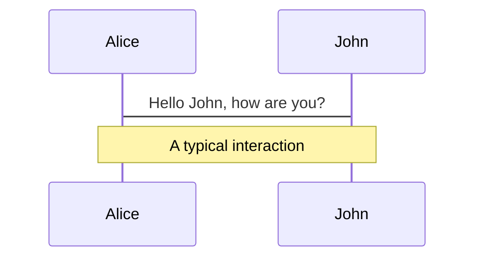
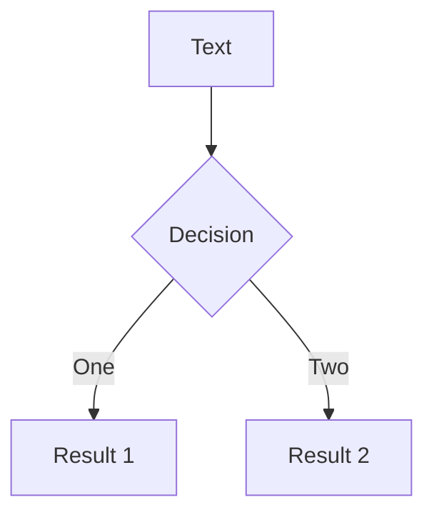
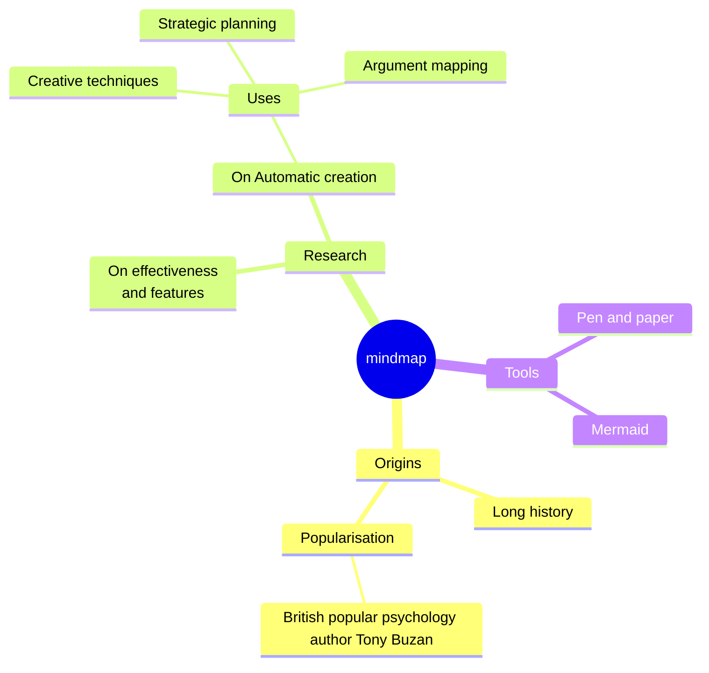
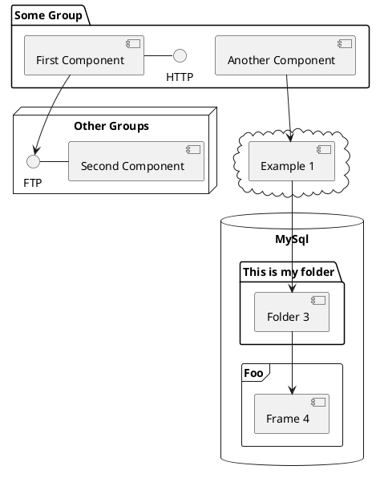

---
# try also 'default' to start simple
# theme: seriph
# theme: academic
# theme: eloc
theme: default
# background: https://cover.sli.dev
# background: assets/party.png
# some information about your slides, markdown enabled
title: TypeScript type-level programming
info: |
  ## Type-level programming
  Arithemetics

# apply any unocss classes to the current slide
class: text-center
# https://sli.dev/custom/highlighters.html
highlighter: shiki
# https://sli.dev/guide/drawing
drawings:
  persist: false
# slide transition: https://sli.dev/guide/animations#slide-transitions
transition: slide-left
# enable MDC Syntax: https://sli.dev/guide/syntax#mdc-syntax
mdc: true
---

# TypeScript type-level programming

Type level arithmetics

---

```yaml
layout: two-cols
layoutClass: gap-16
```

# Table of contents


::right::

<Toc minDepth="1" maxDepth="2"></Toc>

---

## What is Javascript

- Scheme + Self + C + Java = JavaScript


---

```yaml
layout: two-cols
layoutClass: gap-16
```

## TypeScript

Scheme + Self <span class="opacity-20">+ C + Java</span> = JavaScript

Two very dymanic languages. Both are are very flexible and permissive. So as the offspring JS. Good luck with putting type over it.

JavaScript + Types


::right::


---

# Types as a functional programming language

### TypeScript = JavaScript + Types

It _is_ JavaScript, just with added Types.
And Types is a language also. Two for the price of one!

### Type Level Type Script = ~~JavaScript~~ + Types

**TLTS** is a immutable, pure, lazy, functional programming language.

- functional - functions all we have, recursion is our friend (no higher order functions though)
- pure - no input/output
- immutable - we can not re-assign types once they already declared
- lazy - types are evaluated as needed. Opposed to JS eager evaluation.

---

## Types has functions

```ts
// value level
const myFunc(a, b) => ...

// type level
type MyFunc<A, B> = ...
```

```ts
// Typescript type level values are types
let someNum = 37;
let s = "hello";

type someNum = 37;
type s = "hello";

// Typescript type level functions are called Generic types.
type MakeTuple<A, B> = [A, B];
```

Operations on types are different from the ones we have in JS. We only have operations which can make sense on types.

---

## Lazy evaluated

```ts
halt = (c) => (c ? "42" : halt(c));
halt(true); // evaluates to ‘42’
halt(false); // goes infinite

ifFunc = (c, t, f) => (c ? t : f);
ifFunc(true, "yes", "no"); // return yes
ifFunc(true, "yes", halt(false)); // the answer is 'yes' but we never get it

type Halt<C> = C extends true ? "42" : Halt<C>;

type If<C, T, F> = C extends true ? T : F;

type Eval = If<true, "yes", Halt<false>>; // this evaluates to 'yes', cause TS types are lazy evaluated
```


---

## Types of a types

There are two worlds (levels) in a TypeScript.
The value-level and type-level.
On value-level there are values and operations which operate on those values - take values as parameters and return values.

Equivalently.
On type-level there are types and type constructors which operate on those types - take tupes as parameters and return values.

---

### Primitive

- primitive types (A set)
- literal types (TS unique?)

---

```yaml
layout: two-cols
layoutClass: gap-16
```

### Type constructors

Makes types out of other types.
If in type world types are values, then type constuctions are operations on types.

Value level:

- values: `42`, `true`, `hello world`
- operations: `+`, `&&`, `===`
  Type level:
- values: `number`, `boolean`, `string`, `true`, `42`, `hello world`
- operations: create tuple, array, record, object, union, intersection

::right::

- Type level
  - objects `{key1: string; key2: boolean}`
  - records `{[key: string]: number}`
  - arrays `number[]`
  - typles `[string, boolean]`
- union `|`
- intersection `&`
- function type `=>`
  Could think about type operations as data structures for types. We can put other types in and extract them out.

---

### Union

Constructor:

```ts
type T = boolean | string;
```

Access: `???` What does that even mean? Iterate over elements ?
Think as a set of types

### Intersection

Constructor:

```ts
type T = ... & ...
```

Access: `???` What does it even mean? Take original parts ?

---

### Tuples

Constructor:

```ts
type T = [boolean, string];

type T = [first: boolean, second: string]; //tuple elements could have names
type T = [boolean, string?]; //tuple elements could be optional
```

Access:

```ts
type E = T[0 | 1]; // extracting type of individual elements
type E = T[number]; // of all elements
type E = T["length"]; // get tuple length
```

Operations on tuples:
Concat:

```ts
type E = [...T1, ...T2]; // merge tuples

//Tuples and arrays can be combined in the same constructor.
type T = [number, ...number[]]; // non-empty array of numbers
```

---

### Array

Constructor: `type T = boolean[]`
Access: `type E = T[number]` extract type of an array values
Access: `type E = T[0]` same

---

### Objects

Constructor: `type T = { key1: string; key2: boolean }`
Access: `type E = T['key1' | 'key1'] // string | boolean` // get property types
Access: `type E = keyof T // 'key1' | 'key2'` get property keys type
Access: `type E = T[keyof T]` shortcut to get all possible property keys type

---

### Records

Constructor: `type T = { [key: string]: boolean }`, `Record<Keys, Type>`, `Record<K, V> = { [Key in K]: V }`
Access: `type E = T[string]` // get property value type. Not possible Object constructor
Access: `type E = keyof T` // get property keys type

---

### Function type

Constructor: `type T = (input: number) => boolean`
Access: `type P = Parameters<T>`, `type R = ReturnType<T>`

---

### Template type literals

Constructor:

```ts twoslash
type A = "hello";
type B = 37;
type T = `${A} foo ${B}`;
```

Access by pattern matching

```ts twoslash
type E = `a foo 37` extends `${infer A} foo ${infer B extends number}`
  ? [A, B]
  : never;
```

Absolute unique. Togeter with conditional recursive types we can iterate over strings.

```ts twoslash
type MakeMeKebab<S> = S extends `${infer First} ${infer Rest}`
  ? `${First}-${MakeMeKebab<Rest>}`
  : S;

type E = MakeMeKebab<"tomato cheese anchovy cheese">;
```

be amaized: https://github.com/codemix/ts-sql

## Control structures

- Functions

- Conditionals (if-then expressions)

- Pattern matching

- Recursion (loops)

---

### Functions

Generic types are equivalent of function calls.

TLTS functions are generic types. They take types as inputs and values as outputs.

```ts
type Fn<A, B> = A | B;

// functions might have defaults
type Fn<A, B = null> = [A, B];
```

Type constraints. It's possible to specify a type of an input. A type of a type?!

```ts
type Fn<A extends string, B = null> = { [Key in A]: B };
```

Here `A extends string` defines what `A` could be - `A` should be assignable to `string`.  
(Plays similar role to classes constraints in Haskell.)

---

### Conditionals (if-then expressions)

Conditional type: `type X = A extends B ? T : F`
example:`type T = A extends B ? true : false`

Since type-level typescript is a functional programming language, there are no conditional statements,
only conditional type expressions - each type constructor returns a type.

Equivalent JS conditional expression: `let x = A <= B ? true : false`

The `extends` keyword defins A and B subtype relationship - A is a subtype of B.
We can imagine it as
`type T = A is a subtype of B ? true : false`
or
`type T = A is a subset of B ? true : false`
or
`type T = A is assignable to B ? true : false`
or anyother synomym to it
A is a subtype of B (B is a supertype of A) <- A formal definition
A is a subset of B (a set of values of A is a subset of values of B. B includes all values of A)
A is "smaller" then B
A implements B
A extends B
A can be assigned to B
A can be used where B is expected
A can be used in place of B <- a formal meaning of a formal definition
A <: B, A ⊑ B, A ≤: B, A ⊆ B, A -> B

A caveat: In `type T = never extends number ? true : false`, conditional type will be evaluated to `never`.
Even though `never` is a subtype of `number` it is treated specially,
and conditional with `never` on the left of `extends` will always be evaluated to `never`.

Example:
`type If<A extends boolean, T, F> = A extends true ? T : F`
`type E = If<true, 42, string> // 42`

Here `A extends boolean` in a parameter of generic type defines what `A` could be - `A` should be assignable to `boolean`.
It is type constraint (plays similar role to classes constraints in Haskell).
Are they the types for the types?

Constraints are helpful to force TS to infer subtypes of a type parameter - forcing type narrowing.

```ts
const asObj = <S>(value: S) => ({ value });
const obj = asObj("hello"); // { value: string }
```

```ts
const asObj = <S extends string>(value: S) => ({ value });
const obj = asObj("hello"); // { value: 'hello' }
```

---

### IsEqual

`A extends B` define subtype relationship. Not Equality.
TypeScript doesn't provide a way to check if two types are equal.
To check if two types are equal we need to check if

`A` is a subtype of `B`  
and  
`B` is a subtype for `A`

```ts
type Extends<A, B> = A extends B ? true : false;

type Equal<A, B> = [Extends<A, B>, Extends<B, A>] extends [true, true]
  ? true
  : false;
```

Approximation, still wrong on some cases.

---

### Pattern matching

I told you, TLTS is a functional programming language.

TLTS has pattern matching. Ironically JS itself still doesn't.

Pattern matching: Checking if type conforms to some pattern (another type) and deconstructing the type according to the pattern.
Allows to extract the values from type constructors.

Pattern match `T` against pattern with shape `{ id: string, status: _something_ }`

```ts
type GetStatus<T> = T extends { id: string; status: infer S } ? S : never;
type E = GetStatus<{ id: "abc"; status: "ok" }>; // E = 'ok'
```

Pattern match `T` against a tuple.

```ts
type Head<T> = T extends [infer H, ...unknown[]] ? H : never;
type Last<T> = T extends [...unknown[], infer Last] ? Last : never;

type E1 = Head<[1, 2]>; // 1
type E2 = Last<[1, 0, 2]>; // 2
```

Functions are type constructors also, so pattern match works

```ts
type FromFunc<T> = T extends (arg: infer A) => infer R ? { input: A, output R} : never
type E = FromFunc<(i: string) => number> // { input: string; output: string }
```

Works with user-defined type constructors aka Generic Types

```ts
type Thing<Id, Name> = { id: Id; name: Name }

// Pattern matching against Thing generic type
type GetId<T> = T extends Thing<infer Id, infer Name> ? Id : never;

type E = GetId<Thing<string, number> // string
```

A trick to get intermediate results from a computation

```ts
// instead of
type Fn<I> = DoSomething<Calc<I>> & // calling Calc twice here
  DoSomethingElse<Calc<I>>; // and here

// Optimizing type level performance 🤯
// we can use "assign" calculation to intermediate variable
type Fn<X> =
  Calc<X> extends infer Y // get Y from calculation
    ? DoSomething<Y> & DoSomethingElse<Y> // use Result
    : never;
```

Equivalent of Haskell

```haskell
f x =
   let y = ... x ...
   in  ... y ...
```

Trick to constrain an inferred type.

```ts
type FirstIfString<T> = T extends [infer S extends string, ...unknown[]]
  ? S
  : never;
```

`infer S extends string` matches against S, it also ensures that S has to be a string. If S isn’t a string, it takes the false path, which in these cases is never.

---

### Recursion (loops)

Recursive generic types + conditional types (aka Recursive Conditional Types)

```ts
type FnRec<Input> = // recursive function
  Input extends Some // condition
    ? FnRec<DoSomething<Input>> // recursive case
    : BaseCase; // base case
```

Side note: Following functional language tradition TypeScript performs Tail-Call Optimization on Recursive Conditional Types 🤯️

JavaScript itself still don't

Looping over lists

```ts
type Fn<List> = List extends [infer First, ...infer Rest] ? Fn<Rest> : BaseCase;
```

Example

```ts
type Contains<List, X> = List extends [infer First, ...infer Rest]
  ? First extends X
    ? true
    : Contains<Rest, X>
  : false;
```

---

```yaml
transition: slide-up
level: 2
```

# Navigation

Hover on the bottom-left corner to see the navigation's controls panel, [learn more](https://sli.dev/guide/navigation.html)

## Keyboard Shortcuts

|                                                    |                             |
| -------------------------------------------------- | --------------------------- |
| <kbd>right</kbd> / <kbd>space</kbd>                | next animation or slide     |
| <kbd>left</kbd> / <kbd>shift</kbd><kbd>space</kbd> | previous animation or slide |
| <kbd>up</kbd>                                      | previous slide              |
| <kbd>down</kbd>                                    | next slide                  |

<!-- https://sli.dev/guide/animations.html#click-animations -->


<p v-after class="absolute bottom-23 left-45 opacity-30 transform -rotate-10">Here!</p>

---

```yaml
layout: image-right
image: https://cover.sli.dev
```

# Code

Use code snippets and get the highlighting directly, and even types hover![^1]

```ts {all|5|7|7-8|10|all} twoslash
// TwoSlash enables TypeScript hover information
// and errors in markdown code blocks
// More at https://shiki.style/packages/twoslash

import { computed, ref } from "vue";

const count = ref(0);
const doubled = computed(() => count.value * 2);

doubled.value = 2;
```

<arrow v-click="[4, 5]" x1="350" y1="310" x2="195" y2="334" color="#953" width="2" arrowSize="1" />

<!-- This allow you to embed external code blocks -->

<<< @/snippets/external.ts#snippet

<!-- Footer -->

[^1]: [Learn More](https://sli.dev/guide/syntax.html#line-highlighting)

<!-- Inline style -->
<style>
.footnotes-sep {
  @apply mt-5 opacity-10;
}
.footnotes {
  @apply text-sm opacity-75;
}
.footnote-backref {
  display: none;
}
</style>

<!--
Notes can also sync with clicks

[click] This will be highlighted after the first click

[click] Highlighted with `count = ref(0)`

[click:3] Last click (skip two clicks)
-->

---

```yaml
level: 2
```

# Shiki Magic Move

Powered by [shiki-magic-move](https://shiki-magic-move.netlify.app/), Slidev supports animations across multiple code snippets.

Add multiple code blocks and wrap them with <code>````md magic-move</code> (four backticks) to enable the magic move. For example:

````md magic-move
```ts {*|2|*}
// step 1
const author = reactive({
  name: "John Doe",
  books: [
    "Vue 2 - Advanced Guide",
    "Vue 3 - Basic Guide",
    "Vue 4 - The Mystery",
  ],
});
```

```ts {*|1-2|3-4|3-4,8}
// step 2
export default {
  data() {
    return {
      author: {
        name: "John Doe",
        books: [
          "Vue 2 - Advanced Guide",
          "Vue 3 - Basic Guide",
          "Vue 4 - The Mystery",
        ],
      },
    };
  },
};
```

```ts
// step 3
export default {
  data: () => ({
    author: {
      name: "John Doe",
      books: [
        "Vue 2 - Advanced Guide",
        "Vue 3 - Basic Guide",
        "Vue 4 - The Mystery",
      ],
    },
  }),
};
```

Non-code blocks are ignored.

```vue
<!-- step 4 -->
<script setup>
const author = {
  name: "John Doe",
  books: [
    "Vue 2 - Advanced Guide",
    "Vue 3 - Basic Guide",
    "Vue 4 - The Mystery",
  ],
};
</script>
```
````

---

# Components

<div grid="~ cols-2 gap-4">
<div>

You can use Vue components directly inside your slides.

We have provided a few built-in components like `<Tweet/>` and `<Youtube/>` that you can use directly. And adding your custom components is also super easy.

```html
<Counter :count="10" />
```

<!-- ./components/Counter.vue -->
<Counter :count="10" m="t-4" />

Check out [the guides](https://sli.dev/builtin/components.html) for more.

</div>
<div>

```html
<Tweet id="1390115482657726468" />
```

<Tweet id="1390115482657726468" scale="0.65" />

</div>
</div>

<!--
Presenter note with **bold**, *italic*, and ~~striked~~ text.

Also, HTML elements are valid:
<div class="flex w-full">
  <span style="flex-grow: 1;">Left content</span>
  <span>Right content</span>
</div>
-->

---

```yaml
class: px-20
```

# Themes

Slidev comes with powerful theming support. Themes can provide styles, layouts, components, or even configurations for tools. Switching between themes by just **one edit** in your frontmatter:

<div grid="~ cols-2 gap-2" m="t-2">

```yaml
---
theme: default
---
```

```yaml
---
theme: seriph
---
```


</div>

Read more about [How to use a theme](https://sli.dev/themes/use.html) and
check out the [Awesome Themes Gallery](https://sli.dev/themes/gallery.html).

---

# Clicks Animations

You can add `v-click` to elements to add a click animation.

<div v-click>

This shows up when you click the slide:

```html
<div v-click>This shows up when you click the slide.</div>
```

</div>

<br>

<v-click>

The <span v-mark.red="3"><code>v-mark</code> directive</span>
also allows you to add
<span v-mark.circle.orange="4">inline marks</span>
, powered by [Rough Notation](https://roughnotation.com/):

```html
<span v-mark.underline.orange>inline markers</span>
```

</v-click>

<div mt-20 v-click>

[Learn More](https://sli.dev/guide/animations#click-animations)

</div>

---

```yaml
preload: false
```

# Motions

Motion animations are powered by [@vueuse/motion](https://motion.vueuse.org/), triggered by `v-motion` directive.

```html
<div v-motion :initial="{ x: -80 }" :enter="{ x: 0 }">Slidev</div>
```

<div class="w-60 relative mt-6">
  <div class="relative w-40 h-40">
    
    
    
  </div>

  <div
    class="text-5xl absolute top-14 left-40 text-[#2B90B6] -z-1"
    v-motion
    :initial="{ x: -80, opacity: 0}"
    :enter="{ x: 0, opacity: 1, transition: { delay: 2000, duration: 1000 } }">
    Slidev
  </div>
</div>

<!-- vue script setup scripts can be directly used in markdown, and will only affects current page -->
<script setup lang="ts">
const final = {
  x: 0,
  y: 0,
  rotate: 0,
  scale: 1,
  transition: {
    type: 'spring',
    damping: 10,
    stiffness: 20,
    mass: 2
  }
}
</script>

<div
  v-motion
  :initial="{ x:35, y: 40, opacity: 0}"
  :enter="{ y: 0, opacity: 1, transition: { delay: 3500 } }">

[Learn More](https://sli.dev/guide/animations.html#motion)

</div>

---

# LaTeX

LaTeX is supported out-of-box powered by [KaTeX](https://katex.org/).

<br>

Inline $\sqrt{3x-1}+(1+x)^2$

Block

$$
{1|3|all}
\begin{array}{c}

\nabla \times \vec{\mathbf{B}} -\, \frac1c\, \frac{\partial\vec{\mathbf{E}}}{\partial t} &
= \frac{4\pi}{c}\vec{\mathbf{j}}    \nabla \cdot \vec{\mathbf{E}} & = 4 \pi \rho \\

\nabla \times \vec{\mathbf{E}}\, +\, \frac1c\, \frac{\partial\vec{\mathbf{B}}}{\partial t} & = \vec{\mathbf{0}} \\

\nabla \cdot \vec{\mathbf{B}} & = 0

\end{array}
$$

<br>

[Learn more](https://sli.dev/guide/syntax#latex)

---

# Diagrams

You can create diagrams / graphs from textual descriptions, directly in your Markdown.

<div class="grid grid-cols-4 gap-5 pt-4 -mb-6">









</div>

[Learn More](https://sli.dev/guide/syntax.html#diagrams)

---

```yaml
src: ./pages/multiple-entries.md
hide: false
```

---

# Monaco Editor

Slidev provides built-in Moanco Editor support.

Add `{monaco}` to the code block to turn it into an editor:

```ts {monaco}
import { ref } from "vue";
import hello from "./external";

const code = ref("const a = 1");
hello();
```

Use `{monaco-run}` to create an editor that can execute the code directly in the slide:

```ts {monaco-run}
function fibonacci(n: number): number {
  return n <= 1 ? n : fibonacci(n - 1) + fibonacci(n - 2); // you know, this is NOT the best way to do it :P
}

console.log(Array.from({ length: 10 }, (_, i) => fibonacci(i + 1)));
```

---

```yaml
layout: center
class: text-center
```

# Learn More

[Documentations](https://sli.dev) · [GitHub](https://github.com/slidevjs/slidev) · [Showcases](https://sli.dev/showcases.html)

```

```
